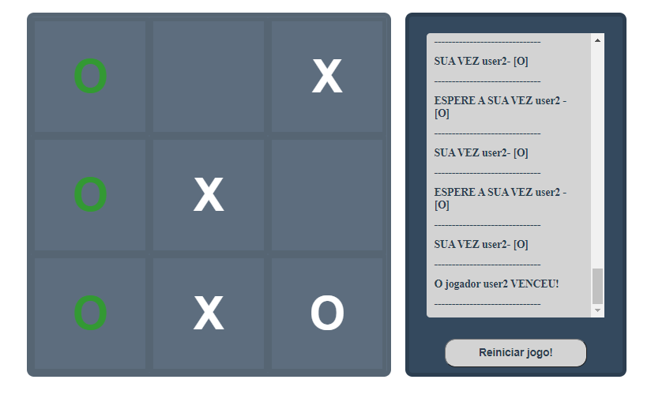
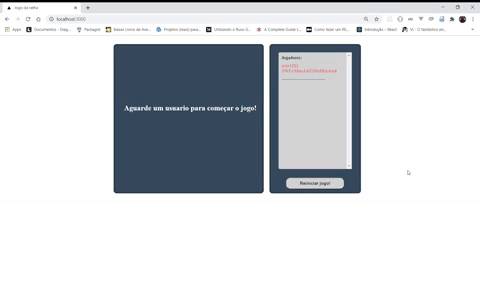

  <a href="#rocket-tecnologias">Tecnologias</a>&nbsp;&nbsp;&nbsp;|&nbsp;&nbsp;&nbsp;
  <a href="#-projeto">Projeto</a>&nbsp;&nbsp;&nbsp;|&nbsp;&nbsp;&nbsp;
  <a href="#-como-rodar">Como rodar</a>&nbsp;&nbsp;&nbsp;|&nbsp;&nbsp;&nbsp;
  <a href="#-como-contribuir">Como contribuir</a>&nbsp;&nbsp;&nbsp;

 

# Jogo da velha (Tic tac toe)

## 🚀 Tecnologias

Esse projeto foi desenvolvido com as seguintes tecnologias:

- [JavaScript](https://developer.mozilla.org/pt-BR/docs/Web/JavaScript) 
- [HTML5](https://developer.mozilla.org/pt-BR/docs/Web/HTML/HTML5) 
- [CSS3](https://developer.mozilla.org/pt-BR/docs/Web/CSS) 
- [NodeJS](https://nodejs.org/en/) 
- [Socket.io](https://socket.io/) 

## 💻 Projeto

Jogo da velha em rede usando Socket.io e node.

O visual do jogo foi baseado no video do canal [Código fonte](https://www.youtube.com/watch?v=M258B1b_pMs)

  

  

  

## 🚀 Como Rodar

- Clone o projeto.
- Entre no repositório e rode "yarn install"
- Rode "yarn start"
- acesse o frontend em "http://localhost:3000"

## 🤔 Como contribuir

- Faça um fork desse repositório;
- Cria uma branch com a sua feature: `git checkout -b minha-feature`;
- Faça commit das suas alterações: `git commit -m 'feat: Minha nova feature'`;
- Faça push para a sua branch: `git push origin minha-feature`.

Depois que o merge da sua pull request for feito, você pode deletar a sua branch.

## 📝 Licença

Esse projeto está sob a licença MIT.
